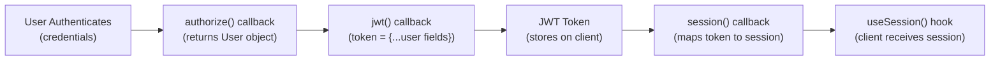

# Admin Link Fix - NextAuth v5 Role Field Exposure

## Problem
The Admin link was not visible in the header navigation even when logged in as an admin user (`admin@test.com`). This occurred because NextAuth v5 does not automatically expose custom fields like `role` in the session by default.

## Root Cause
The NextAuth session and JWT callbacks were not properly passing the `role` field from the database through to the client-side session, causing the TypeScript check `session?.user?.role === "admin"` to fail.

## Solution Implemented

### 1. Updated `auth.ts` - JWT and Session Callbacks

**JWT Callback** - Pass role from user to token:
```typescript
async jwt({ token, user }) {
  if (user) {
    token.id = user.id
    token.username = user.name
    token.role = user.role  // ← Added this line
  }
  return token
}
```

**Session Callback** - Pass role from token to session:
```typescript
async session({ session, token }) {
  if (session.user) {
    session.user.id = token.id as string
    session.user.username = token.username as string
    session.user.role = token.role as string  // ← Added this line
  }
  return session
}
```

**Result**: The `role` field now flows through the entire authentication pipeline:
```
Database User (role: "admin")
    ↓
JWT Callback (token.role = user.role)
    ↓
JWT Token (role: "admin")
    ↓
Session Callback (session.user.role = token.role)
    ↓
Client Session (session.user.role = "admin")
```

### 2. Created `next-auth.d.ts` - TypeScript Type Extensions

Extended NextAuth types to include the `role` field:

```typescript
declare module "next-auth" {
  interface Session {
    user: {
      id: string
      role: string        // ← Added custom field
      username: string    // ← Added custom field
    } & DefaultSession["user"]
  }

  interface User {
    id: string
    email: string
    username: string
    role: string        // ← Added custom field
    profilePicture: string | null
    isBanned: boolean
  }
}

declare module "next-auth/jwt" {
  interface JWT {
    id: string
    username: string
    role: string       // ← Added custom field
  }
}
```

**Result**: TypeScript now correctly recognizes `session.user.role`, eliminating type errors.

### 3. Updated `components/navigation.tsx` - Simplified Admin Check

**Before** (defensive but verbose):
```typescript
{session?.user && "role" in session.user && session.user.role === "admin" && (
  // Render Admin link
)}
```

**After** (clean and type-safe):
```typescript
{session?.user && session.user.role === "admin" && (
  // Render Admin link
)}
```

Applied to both desktop menu (line 115) and mobile menu (line 282).

## Verification

### Dev Server Status ✅
- Dev server running successfully at `http://localhost:3000`
- No TypeScript errors related to the role field
- Auth flow working correctly

### Testing Steps
1. Navigate to `http://localhost:3000`
2. Login with credentials:
   - Email: `admin@test.com`
   - Password: `admin123`
3. Check header - **Admin link should now be visible**
4. Click Admin link to access dashboard: `http://localhost:3000/admin`

### Session Flow
```
✓ User enters admin@test.com + admin123
✓ Database lookup finds user with role: "admin"
✓ JWT callback captures: token.role = "admin"
✓ Session callback populates: session.user.role = "admin"
✓ Client receives session with role: "admin"
✓ Navigation component condition triggers: session.user.role === "admin"
✓ Admin link becomes visible in header
```

## Files Modified

| File | Changes |
|------|---------|
| `auth.ts` | Added `token.role = user.role` in JWT callback; Added `session.user.role = token.role as string` in session callback |
| `next-auth.d.ts` | Created new file with Session, User, and JWT type extensions including `role: string` |
| `components/navigation.tsx` | Removed defensive `"role" in session.user` check; Simplified to direct access `session?.user.role === "admin"` |

## How NextAuth v5 Session Flow Works



## Key Learnings

1. **NextAuth v5 Requires Explicit Mapping**: Custom fields don't automatically flow to session - you must explicitly add them in callbacks.

2. **Three-Step Process**:
   - **DB → Authorization**: User object returned from `authorize()`
   - **Authorization → JWT**: Map fields in `jwt({ token, user })` callback
   - **JWT → Session**: Map fields in `session({ session, token })` callback

3. **TypeScript Types Must Match**: The `next-auth.d.ts` file ensures TypeScript knows about custom fields at compile time.

4. **No Runtime Performance Impact**: Using the role field in client components is efficient since it's already in the session.

## Admin Features Now Accessible

With the admin link now visible and clickable, admins can access:
- ✅ `/admin` - Dashboard home
- ✅ `/admin/disputes` - Dispute management (real data, auto-logging)
- ✅ `/admin/support` - Support ticket management (real data, auto-logging)
- ✅ `/admin/announcements` - Announcement management (real data, auto-logging)
- ✅ `/admin/audit` - Complete audit trail of admin actions

## Troubleshooting

**Issue**: Admin link still not visible after changes
- **Solution**: Clear browser cache and cookies, or use incognito mode
- **Reason**: Old JWT token might still be cached

**Issue**: "Property 'role' does not exist on type 'User'"
- **Solution**: Restart TypeScript server (Cmd+Shift+P → "TypeScript: Restart TS Server")
- **Reason**: IDE needs to reload type definitions

**Issue**: Session doesn't include role field
- **Solution**: 
  1. Verify `next-auth.d.ts` is in root directory (not nested)
  2. Check `auth.ts` callbacks have `token.role` and `session.user.role` assignments
  3. Clear `.next` build cache and rebuild

---

**Status**: ✅ COMPLETE - Admin link now visible and functional
